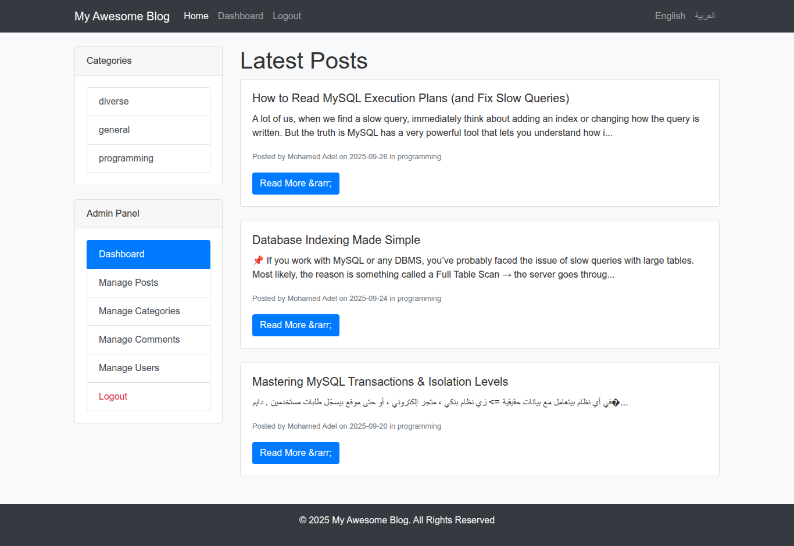
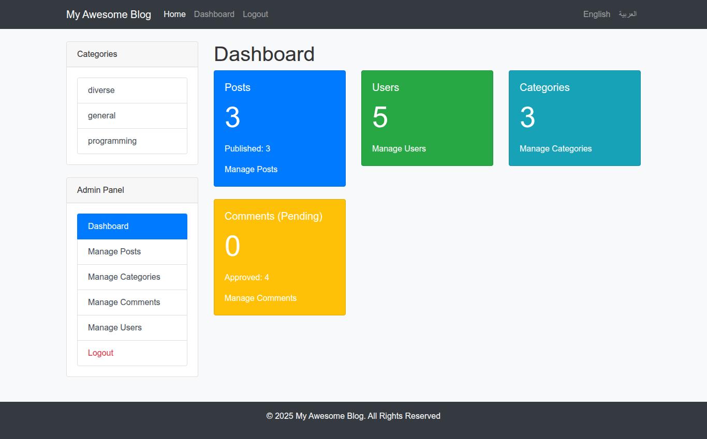

Blog System
A simple blog system built with PHP and MySQL, featuring user authentication, post management, categories, and comments.
Features

User registration, login, and logout with CSRF protection.
Password hashing using password_hash and verification with password_verify.
Multi-language support (Arabic and English).
Admin dashboard for managing posts, categories, comments, and users.
Single post view with comments (public/single_post.php).
Responsive design using Bootstrap.

Requirements

PHP 7.4 or higher
MySQL 5.7 or higher
Apache web server (LAMP stack recommended)

Installation

Clone the repository:git clone https://github.com/mohamed-adel-code/blog_system.git

Navigate to the project directory:cd blog_system

Set up the database:
Create a MySQL database.
Import the database.sql file to set up the required tables:mysql -u [username] -p [database_name] < database.sql

Configure the application:
Copy includes/config.sample.php to includes/config.php.
Edit includes/config.php to add your database credentials and other settings.

Run the application:
Place the project in your web server's root directory (e.g., /var/www/html).
Alternatively, use PHP's built-in server for development:php -S localhost:8000 -t public

Access the application at http://localhost:8000.

Dependencies

Bootstrap 4: Used for responsive design (included in public/assets/css/bootstrap.min.css and public/assets/js/bootstrap.min.js).
jQuery 3.5.1 (slim): Used for Bootstrap JavaScript components.
Popper.js: Required for Bootstrap dropdowns and tooltips.

Usage

Visit http://localhost/public/index.php to view the blog.
Register or log in to access the admin dashboard at http://localhost/admin/index.php.
Manage posts, categories, comments, and users from the admin dashboard.
Switch between Arabic and English using the language toggle in the header.

Contributing
Contributions are welcome! Please follow these steps:

Fork the repository.
Create a new branch (git checkout -b feature/your-feature).
Commit your changes (git commit -m 'Add your feature').
Push to the branch (git push origin feature/your-feature).
Open a pull request.

License
This project is licensed under the MIT License. See the LICENSE file for details.

## Screenshots

